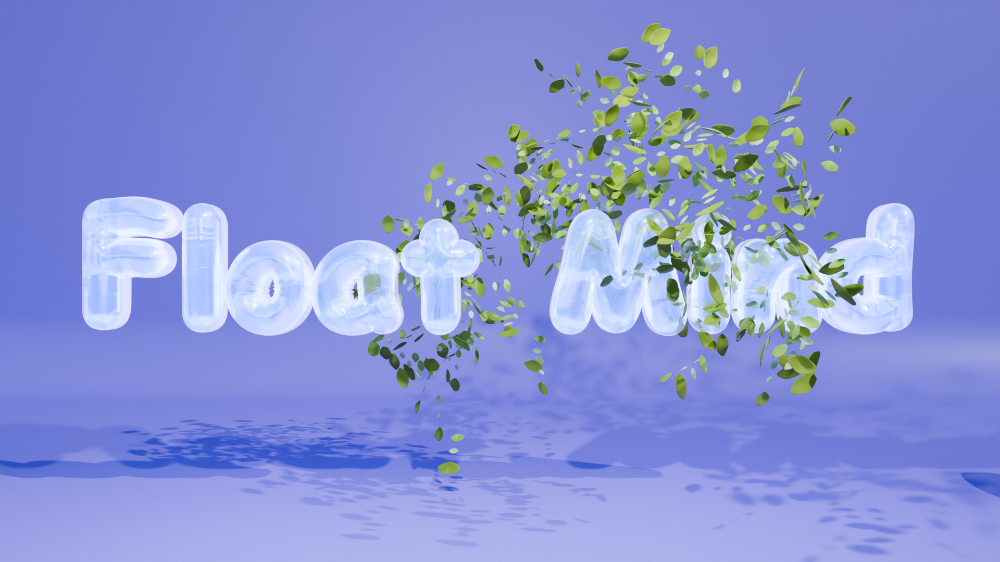

# Float Mind

**[XR Design Challenge 2024](https://immersive-insiders.com/xrdc24) Product | [Finalist Product](https://immersive-insiders.com/xrdc24-finalists)**

&emsp;
&emsp;
&emsp;
&emsp;
&emsp;

## Inspiration

In our fast-paced world, stress and emotional disconnect are widespread. To address this, we explored how new
technologies could help stressed individuals relax and recharge quickly. Inspired by mindfulness and visual-based
meditation, our team developed a gamified meditation approach. This helps users relax their bodies and minds while
visualizing and overcoming emotional challenges. Our solution blends gamification, AR/VR, and AI to make mental wellness
practices more engaging and impactful.

    
What it does

**Float Mind** is an AI-powered AR/VR meditation tool designed to help stressed individuals effectively relax and
reconnect with their emotions through an immersive mindfulness experience. With a seamless, controller-free interface on
Meta Quest, it offers a unique combination of AI-driven emotional insights and interactive meditation practices.
The experience begins with Flo, an empathetic AI companion that analyzes users’ thoughts and visualizes their positive
and negative emotions as interactive 3D bubbles. Through intuitive hand gestures, users engage with these bubbles,
dynamically shaping their virtual environment. This transitions seamlessly into a guided meditation phase, where calming
breathing exercises, soothing animations, and interactive elements like growing auroras and nurturing trees promote
mindfulness and relaxation.

    
Why it matters

**Float Mind** integrates cutting-edge AI with immersive technology to redefine traditional mindfulness practices. It
provides a trusted, science-backed mental wellness solution, offering busy professionals an accessible and impactful way
to manage stress and enhance emotional well-being, whether at work or at home.

    
How we built it

**Float Mind** was developed using Meta Quest 3/Pro, Unity 6, and advanced AI technologies such as scene understanding,
speech-to-text (STT), text-to-speech (TTS), and large language model (LLM). The emotional analysis feature leverages LLM
Agent (GPT-o1 mini model) to detect positivity and negativity in user input, while the AR/VR experience was crafted
using Meta XR All-in-One SDK. Our team combined expertise in AI, UI/UX design, and immersive 3D environments to create a
seamless and engaging user journey. Rigorous testing ensured the interactivity and flow worked smoothly without the need
for controllers.

    
Challenges we ran into

**1. Device constraints. For example, eye tracking feature is only available on Meta Quest Pro headset.**

> Solution: Change the design and refrain from applying eye tracking.

**2. Inhaling and exhaling breath effect.**

> Solution: Utilize VFX Effect Graphics Editorto dynamically adjust particle density and motion paths, aligning
> seamlessly with the rhythmic flow of meditation breathing.

**3. Portal effect to bridge the virtuality and reality.**

> Solution: Develop a custom shader to create a see-through render texture for virtual scenes, incorporating rotating
> and edge-dissolving effects with an albedo material and alpha texture. Adjust scene layers and camera culling settings
> to achieve a portal effect.

**4. Blender geometry node animation compatibility with Unity.**

> Solution: Utilize MDD exporting format to remap Blender's geometry node effects into frame-based animation clips,
> enabling seamless integration with the Unity Animator.

**5. Unity
plugin [Figma Converter for Unity](https://assetstore.unity.com/packages/tools/utilities/figma-converter-for-unity-198134)
compatibility issues and bugs.**

> Solution: Dive into the source code and fix them.

**6. Frame layout offset issue when switching frames via enabling/disabling.**

> Solution: Use `RectTransform.sizeDelta` property to realize switching, i.e., set it to `Vector2.zero` to hide.

## Accomplishments that we're proud of

We're proud to create an immersive and gamified meditation tool that embraces cutting-edge AI and AR/VR technology,
grounded in the science of mindfulness and psychology. We crafted a visually stunning 3D environment with intuitive
spatial interactions and audio-reactive animation.

Significant technical achievements include the successful integration of LLM-driven emotional analysis with AR/VR
interactions and the delivery of a seamless controller-free VR headset experience. The core immersive interactions rely
on hand tracking, combined with hand gesture detection.

### 1. Bridge AR and VR through User Actions

Through thoughtful UX design, we empowered users to seamlessly bridge the gap between AR and VR experiences, amplifying
participatory joy.

### 2. Interactive 3D CTA

We innovated by replacing traditional 2D CTAs with a 3D cube, allowing users to proceed, revert actions, or engage with
the AI agent all within a single interactive element.

### 3. Meditation Therapy LLM Agent

We developed an LLM-powered agent designed specifically for meditation therapy, providing dynamic, personalized guidance
and emotional support.

### 4. Multi-Modal Input via Hand Gesture Detection

Using advanced hand tracking, we recognized gestures—such as index-finger poking, double-hand waving, and pushing—to
enable intuitive, controller-free interactions.

### 5. Audio-Driven Prompting and Mood Detection

By feeding audio input to the LLM agent, we gauged positive or negative user moods in real time, generating responsive,
interactable “bubbles” to enhance engagement.

### 6. Seamless Scene Blending with Meta Scene API

We harnessed the Meta Scene API to capture physical-world meshes, effortlessly merging real-world surroundings with the
virtual scene during the bubble interaction phase.

### 7. Dissolving Transition Effect

A gradual dissolving effect transitions users from the real world to the virtual environment, maintaining immersion and
ensuring a smooth user experience.

### 8. AI Agent Avatar with Real-Time Audio

We incorporated text-to-speech for the agent’s GPT-generated responses, supported by real-time audio reflection to
enrich interactivity and bring the avatar to life.

What we learned

### 1. XR + UX

Bridging XR and UX with the help of fine-tuned plugins and customized scripts.

### 2. XR + AI

Applying scene understanding to sense user's surroundings, generating seamless virtual-real world blending, and
employing LLMs capacities to process context (e.g., user's emotion) to facilitate personalized immersive experience.

### 3. Multidisciplinary Integration

Integrating diverse multidisciplinary tools from design to development, 2D to 3D, text to audio, and vice versa.
Creating immersive experience with environment, animations, sounds, visuals, and interactions.

    
What's next for Float Mind

- Expand **Float Mind**’s emotional analysis capabilities to recognize a broader range of sentiments and introduce more
  interactive meditation elements.
- Integrate biofeedback mechanisms to make the experience even more personalized.
- Explore partnerships with mental health professionals and wellness organizations to bring **Float Mind** to a wider
  audience.

## Team

- Zia (Zihan Li), **Game Designer & Product Designer, AI Agent Game Developer, UPenn Architecture Student**, [Personal Website](https://www.zihanli.org/)
- Jennifer (Yan Zeng), **Product Design, XR/UX/UI Design, User Flow, Wireframing, Prototyping, 3D Design & Modelling
  Product Designer specializes in SaaS+AI | Mixed Reality Creator | 3D Artist | Gaming Enthusiast | Architectural
  Designer | Cat Lover @UPenn**, [LinkedIn](https://www.linkedin.com/in/jennifer-zeng-b4244b171/)
- Tingting Luo, **UX Researcher & Designer, 3D Animation Artist**, [LinkedIn](https://www.linkedin.com/in/tingting-luo-uiux/)
- Muki (Shuqi Liao), **XR Developer, CS PhD Student**, [Personal Website](https://yvettemuki.github.io/)
- Luffy (Liuchuan Yu), **Developer & Bug Fixer, CS PhD Student Dedicated to AI + XR**, [Personal Website](https://www.chuange.org/)

## Acknowledgements

**Float Mind** can not be made possible without amazing Unity Assets and open-source projects. Special thanks to the following.

### Unity Assets

- [AllSky Free](https://assetstore.unity.com/packages/2d/textures-materials/sky/allsky-free-10-sky-skybox-set-146014)
- [Aura 2](https://assetstore.unity.com/packages/tools/particles-effects/aura-2-volumetric-lighting-fog-137148)
- [Dreamscapes](https://assetstore.unity.com/packages/3d/environments/dreamscapes-50924)
- [Figma Converter for Unity](https://assetstore.unity.com/packages/tools/utilities/figma-converter-for-unity-198134)
- [Portals for VR](https://assetstore.unity.com/packages/vfx/portals-for-vr-228871)
- [Procedural Aurora](https://assetstore.unity.com/packages/vfx/particles/environment/procedural-aurora-116309)
- [URP Shield Bubble VFX](https://assetstore.unity.com/packages/vfx/shaders/urp-shield-bubble-vfx-170401)

### Open-Source Projects
- [OpenAI-Unity](https://github.com/srcnalt/OpenAI-Unity)
- [OpenAI-Unity/feature/text-to-speech](https://github.com/srcnalt/OpenAI-Unity/compare/master...alphdevcode:OpenAI-Unity:feature/text-to-speech)